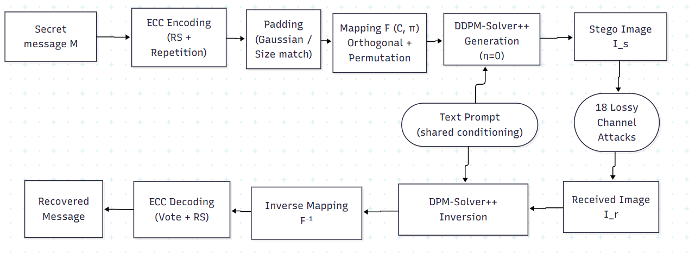

# ATLEF: Adaptive Two-Layer Error Correction Framework

[](https://doi.org/10.5281/zenodo.22779626)

Core implementation of **ATLEF**, a training-free framework for payload-capacity robust generative image steganography, from the MSc thesis:

**"ATLEF: Payload-Capacity Robust Generative Image Steganography"**
Emmanuel Owusu-Larbi (PG7109424), Department of Computer Science, Kwame Nkrumah University of Science and Technology.
MSc Cybersecurity and Digital Forensics, 2026.
Supervisor: Dr. Benjamin Tei Partey.

ATLEF combines Reed-Solomon outer coding with adaptive repetition inner coding and a deterministic random-padding correction to embed and recover messages through Stable Diffusion 1.5's latent space, evaluated across 1,024, 2,048, and 4,096-bit payloads under 18 channel-distortion conditions.

This repository provides the core components documented in Appendix A of the thesis: message encoding and decoding, error correction, attack simulation, and the three steganalysis network architectures (SRNet, YeNet, XuNet) used for detectability evaluation. It is not a full experiment orchestration package; see [Scope](#scope) below.



## Built on

The dual-key latent mapping module and the underlying Stable Diffusion 1.5 generation/inversion pipeline are from:

Hu, X., Li, S., Ying, Q., Peng, W., Zhang, X. and Qian, Z. (2024) "Establishing Robust Generative Image Steganography via Popular Stable Diffusion," *IEEE Transactions on Information Forensics and Security*, 19, pp. 8094-8108. [doi: 10.1109/TIFS.2024.3444311](https://doi.org/10.1109/TIFS.2024.3444311)

Their implementation: [github.com/HXX5656/mas_GRDH](https://github.com/HXX5656/mas_GRDH)

ATLEF's contribution is the two-layer error correction pipeline, the random-padding correction, and the evaluation framework built on top of that generation pipeline, not the diffusion model or the mapping module itself.

## Scope

This repository contains the components that are ATLEF-specific and documented in Appendix A of the thesis. It does not include a top-level orchestration script, dependency lock file, or dataset/prompt manifests, that package was explicitly scoped out during the thesis review process (see Appendix A and Section 3.5.4). What's here is sufficient to inspect, verify, and reuse the core algorithm; it is not a one-command reproduction of every figure and table in the thesis.

To generate and invert images, you'll need Stable Diffusion 1.5 and the DPM-Solver++ pipeline set up per Hu et al.'s repository above. This repository's code operates on the resulting latent tensors.

## Repository structure

```
atlef_implementation/
├── README.md
├── requirements.txt
├── requirements-lock.txt
├── LICENSE
├── run_pipeline.py
├── experiment_config.py
├── compute_checksums.py
├── assets/
│   └── architecture-diagram.png
├── manifests/
│   ├── coco_prompts.json
│   ├── flickr8k_prompts.txt
│   ├── deskgpt_prompts.txt
│   ├── train_images_index.csv
│   └── test_images_index.csv
├── results/
│   ├── checksums.txt
│   ├── fast_after_COCO.csv
│   ├── fast_after_Flickr8K.csv
│   ├── fast_after_DeskGPT.csv
│   ├── detectability_results.csv
│   ├── fid_results.csv
│   └── kid_results.csv
└── src/
    ├── constants.py
    ├── encoder.py
    ├── decoder.py
    ├── attacks.py
    └── steganalysis/
        ├── srm_kernels.py
        ├── srnet.py
        ├── yenet.py
        └── xunet.py
```

## Installation

```bash
git clone https://github.com/HexnDex/atlef_implementation
cd atlef_implementation
pip install -r requirements.txt
```

Python 3.10+ and a CUDA-capable GPU are recommended; all reported results were produced on an NVIDIA A100 (Google Colab Pro+).

## Weights

ATLEF uses the same Stable Diffusion 1.5 checkpoint as the baseline it builds on. Download it from:

- [Comfy-Org/stable-diffusion-v1-5-archive](https://huggingface.co/Comfy-Org/stable-diffusion-v1-5-archive) (Hugging Face), a hash-identical re-upload of the original RunwayML weights. The original `runwayml/stable-diffusion-v1-5` page has a history of intermittent downtime, this archive is the more reliable source.

This archive hosts `v1-5-pruned-emaonly.safetensors`. The thesis experiments were run against `v1-5-pruned.ckpt` (EMA + non-EMA weights); for generation and inversion, which is all this pipeline does, the two are functionally equivalent, the non-EMA weights only matter for continued training.

The checkpoint is not included in this repository.

## Usage

### Encode and decode a message

```python
import torch
from src.encoder import encode_after_robust
from src.decoder import decode_latent_to_bits_after

key_C, key_shuffle = 13579, 24680
message = torch.randint(0, 2, (1024,))

# Encode: message bits -> latent tensor
z, meta = encode_after_robust(message, key_C, key_shuffle, scale=0.16)

# ... pass z through Stable Diffusion generation, transmit the image,
#     invert it back to a latent tensor via DPM-Solver++ (see Hu et al.) ...

# Decode: latent tensor -> recovered message bits
recovered = decode_latent_to_bits_after(z, key_C, key_shuffle, meta)
assert torch.equal(recovered, message)
```

Use `encode_after_capacity` instead of `encode_after_robust` for the uncoded, maximum-payload mode (no Reed-Solomon, no repetition).

### Apply an attack

```python
from PIL import Image
from src.attacks import ATTACKS

img = Image.open("stego.png")
attack_fn, kwargs = ATTACKS["jpeg50"]
attacked = attack_fn(img, **kwargs)
```

`ATTACKS` contains all 18 conditions from Table 3.4 of the thesis:

| Category | Conditions |
|---|---|
| Lossless | `clean`, `png` |
| JPEG compression | `jpeg90`, `jpeg70`, `jpeg50` |
| Resize | `resize0.5`, `resize0.75`, `resize1.25`, `resize1.5` |
| Gaussian noise | `gnoise01`, `gnoise05`, `gnoise10` |
| Gaussian blur | `gblur3`, `gblur5`, `gblur7` |
| Median blur | `mblur3`, `mblur5`, `mblur7` |

### Run a steganalysis model

```python
import torch
from src.steganalysis.srnet import Srnet
from src.steganalysis.yenet import YeNet
from src.steganalysis.srm_kernels import build_srm_kernels
from src.steganalysis.xunet import XuNet

srnet = Srnet()
yenet = YeNet(build_srm_kernels())
xunet = XuNet()

patch = torch.randn(1, 1, 256, 256)  # grayscale 256x256 patch
srnet_logit = srnet(patch)          # (1, 1) — sigmoid for stego probability
yenet_logits = yenet(patch)         # (1, 2) — softmax for class probabilities
xunet_logits = xunet(patch)         # (1, 2) — softmax for class probabilities
```

Trained checkpoints are not included in this repository. Training code and configuration are documented in Section 3.5.3 and Section 4.5 of the thesis.

## Notes

- Function names in `encoder.py` and `decoder.py` (`after_encode_core`, `after_make_permutation`, etc.) match the thesis's Appendix A listings directly, so the code and the document can be cross-checked line by line.
- The random padding correction (Section 4.1.2) is implemented in `after_encode_core` inside `encoder.py`. It replaces zero-padding with deterministic seeded random bits to preserve the latent's N(0, I) distribution, the fix that motivated the thesis's ablation study in Section 4.7.
- `XuNet`'s KV filter is defined as a trainable `nn.Parameter` but is wrapped in `torch.no_grad()` during the forward pass, so it never receives gradients in practice. This matches what was actually trained and evaluated for the thesis's reported results; it is preserved here rather than changed, since changing it would break reproducibility with those results.

## Citation

If you use this code, please cite the thesis:

```bibtex
@mastersthesis{owusularbi2026atlef,
  author = {Owusu-Larbi, Emmanuel},
  title  = {ATLEF: Payload-Capacity Robust Generative Image Steganography},
  school = {Kwame Nkrumah University of Science and Technology},
  year   = {2026},
  type   = {MSc Thesis},
  note   = {Department of Computer Science, Cybersecurity and Digital Forensics}
}
```

And, since ATLEF builds directly on their mapping module and generation pipeline, the baseline this work extends:

```bibtex
@ARTICLE{huGRDH2024,
  author  = {Hu, Xiaoxiao and Li, Sheng and Ying, Qichao and Peng, Wanli and Zhang, Xinpeng and Qian, Zhenxing},
  journal = {IEEE Transactions on Information Forensics and Security},
  title   = {Establishing Robust Generative Image Steganography via Popular Stable Diffusion},
  year    = {2024},
  volume  = {19},
  pages   = {8094-8108},
  doi     = {10.1109/TIFS.2024.3444311}
}
```

## License

This repository is released under the [MIT License](LICENSE). The code depends on and interoperates with Hu et al.'s repository (see [Built on](#built-on)); refer to their repository for the license terms covering their code and weights.
